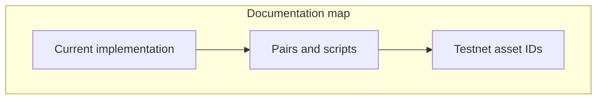
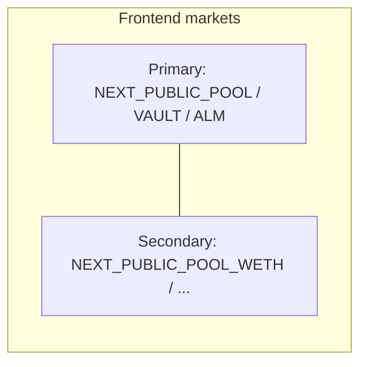

# Welcome

In it's [Current implementation](architecture/current-implementation.md), DeltaFlow is an Automated Market Maker (AMM) on Hyperliquid, which extends the ability of traditional AMMs through:

* Spot-index pricing
* Vault-held liquidity
* Hedging swaps on HyperCore

## **Why this design?**

#### Spot-index pricing

The dominant approach for AMMs has been to price swaps based on the underlying pool reserves. If a pool contains 2 ETH and 4000 USDC, the ETH is priced at \~2000 USDC each. In practice, if a trader wanted to purchase 1 ETH from this pool, they would pay \~4012 USDC. This is because most AMMs use the constant product formula, which aims to maintain the value of the product of each token reserve before and after a swap. As a result, when making large trades in illiquid pools, execution price often exceeds the value a trader would pay on centralised or highly liquid markets.&#x20;

DeltaFlow decouples price from token reserves. Using Hyperliquid's Precompiles, we quote prices from Hyperliquid's order book — a deep, highly liquid, rapidly updating market. Traders are no longer forced up the constant-product curve because on-chain liquidity is shallow.

This documentation matches **`contracts/src`** and the backend in this repository. For the full detail, start with [Current implementation](architecture/current-implementation.md).

Labels for the **base** symbol (e.g. PURR vs WETH) use **`NEXT_PUBLIC_PRIMARY_BASE_SYMBOL`** and **`NEXT_PUBLIC_SECONDARY_BASE_SYMBOL`** (see [Pairs and deployment scripts](deployment/pairs-and-scripts.md)).

## What to read first

| If you want to…                                                  | Go to                                                            |
| ---------------------------------------------------------------- | ---------------------------------------------------------------- |
| **What the code does today** (fees, swaps, Core, escrow)         | [Current implementation](architecture/current-implementation.md) |
| Deploy **primary** vs **secondary** USDC/base stack              | [Pairs and deployment scripts](deployment/pairs-and-scripts.md)  |
| **Spot indices, token ids, `10000+spotIndex`**                   | [Testnet asset IDs](deployment/testnet-asset-ids.md)             |
| Run the stack locally                                            | [Quick start](getting-started/quick-start.md)                    |
| **Deploy → backend + frontend → trades → fund a test portfolio** | [Full stack runbook](getting-started/full-stack-runbook.md)      |
| System overview                                                  | [Architecture](architecture/overview.md)                         |
| On-chain components                                              | [Protocol contracts](protocol/contracts.md)                      |
| Backend & API                                                    | [Backend API](operations/backend-api.md)                         |

## At a glance

* **Chain:** Hyperliquid Testnet HyperEVM (chain ID `998`) for development.
* **On-chain:** `SovereignPool` + `SovereignALM` + `SovereignVault` + default **DeltaFlow** fee stack (`DeltaFlowCompositeFeeModule`, `FeeSurplus`, `DeltaFlowRiskEngine`) or `BalanceSeekingSwapFeeModuleV3` + **`HedgeEscrow`** per market stack. External-vault pools enforce matching **`hedgePerpAssetIndex`** and **`processSwapHedge`** (perp IOC; optional **mark-based** batch threshold + opposite-direction **netting**; see deployment env **`USE_MARK_MIN_HEDGE_SZ`**).
* **Pairs:** **Primary** stack (`NEXT_PUBLIC_POOL`, …) and optional **secondary** stack (`NEXT_PUBLIC_POOL_WETH`, …) use the same contract family per **USDC/base** market. See [Pairs and deployment scripts](deployment/pairs-and-scripts.md).
* **Off-chain:** FastAPI backend for swap logs, **`HEDGE_ESCROW`**, **`PURR_TOKEN_INDEX`**, **`/escrow/trades`**; Next.js for swap, liquidity, and Hedge UI.

For the **accurate, code-level** description, use [Current implementation](architecture/current-implementation.md).
