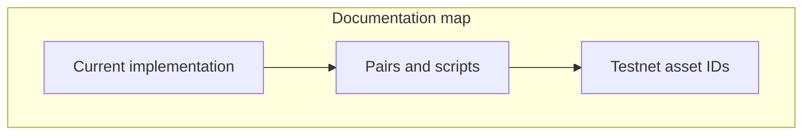

# DeltaFlow

**AMM on HyperEVM** — spot-index pricing, fees, vault-held liquidity, and **HedgeEscrow** (CoreWriter spot surface; perp risk layered by strategy — see [Current implementation](architecture/current-implementation.md)).

This documentation matches **`contracts/src`** and the backend in this repository. For the full detail, start with [Current implementation](architecture/current-implementation.md).

## What to read first

| If you want to… | Go to |
|-----------------|--------|
| **What the code does today** (fees, swaps, Core, escrow) | [Current implementation](architecture/current-implementation.md) |
| Deploy **USDC/PURR** vs **USDC/WETH** | [Pairs and deployment scripts](deployment/pairs-and-scripts.md) |
| **Spot indices, token ids, `10000+spotIndex`** | [Testnet asset IDs](deployment/testnet-asset-ids.md) |
| Run the stack locally | [Quick start](getting-started/quick-start.md) |
| System overview | [Architecture](architecture/overview.md) |
| On-chain components | [Protocol contracts](protocol/contracts.md) |
| Backend & API | [Backend API](operations/backend-api.md) |

## At a glance

- **Chain:** Hyperliquid Testnet HyperEVM (chain ID `998`) for development.
- **On-chain:** `SovereignPool` + `SovereignALM` + `SovereignVault` + default **DeltaFlow** fee stack (`DeltaFlowCompositeFeeModule`, `FeeSurplus`, `DeltaFlowRiskEngine`) or `BalanceSeekingSwapFeeModuleV3` + **`HedgeEscrow`** per market stack. External-vault pools enforce matching **`hedgePerpAssetIndex`** and **`processSwapHedge`** (perp IOC; optional **`MIN_PERP_HEDGE_SZ`** escrow + batch until hedge minimum).
- **Pairs:** Primary docs describe **USDC/PURR**; **USDC/WETH** uses the same contracts in a **separate** deploy (vault + pool + ALM + fee module per pair). See [Pairs and deployment scripts](deployment/pairs-and-scripts.md).
- **Off-chain:** FastAPI backend for swap logs, **`HEDGE_ESCROW`**, **`PURR_TOKEN_INDEX`**, **`/escrow/trades`**; Next.js for swap, liquidity, and Hedge UI.

For the **accurate, code-level** description, use [Current implementation](architecture/current-implementation.md).
