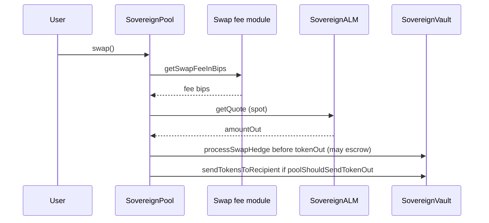
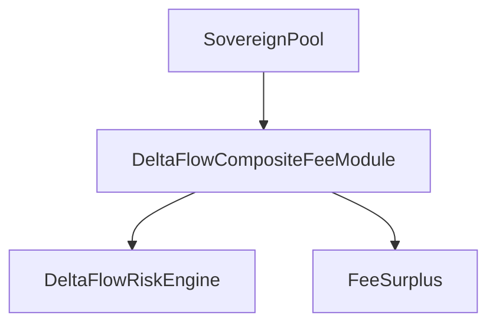
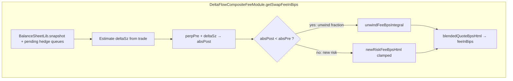
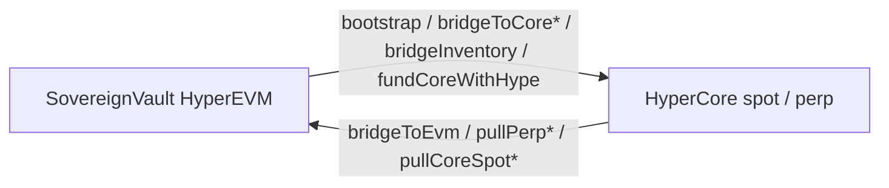
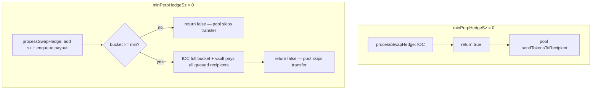
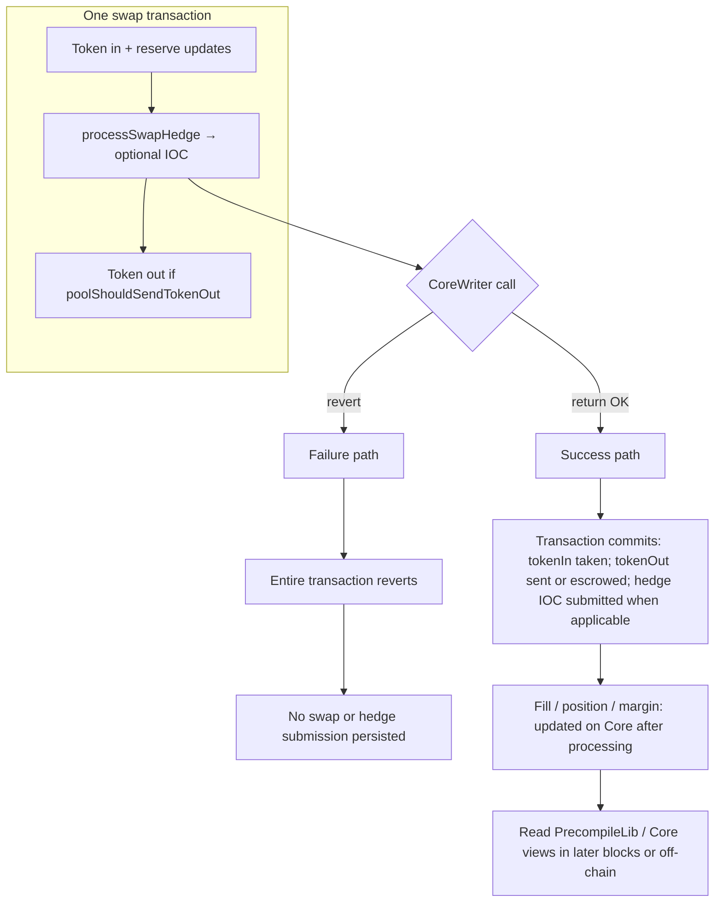

# Current implementation (trading, fees, routing)

This page describes **what the repository code does today** on **HyperEVM**: **USDC** quoted against a **base spot asset** (the primary deployment uses **PURR**; the same contracts can target **WETH** with a separate deploy and correct spot indices / decimals). The default **`DeployAll`** path wires **DeltaFlow** on-chain fee components; **BalanceSeekingSwapFeeModuleV3** remains available when **`DEPLOY_DELTAFLOW_FEE=false`**. Off-chain **API wallet** hedging is **not** the backend execution path; see **Hedge escrow** below.

---

## Trading (user-facing)

1. **Execution path** — Users trade **on-chain** by calling **`SovereignPool.swap()`**. The frontend submits this via wallet (`useSwap` → pool address + ABI).

2. **Pair** — Typically **USDC** + **base** (e.g. **PURR** with **5** decimals on testnet, or **WETH** with **18** decimals). The UI must match token decimals for the deployed pool.

3. **Pricing** — Output amounts are **not** from constant-product reserves. **`SovereignALM`**:
   - Reads **`PrecompileLib.normalizedSpotPx(spotIndex)`** for the configured market and derives **USDC per 1 base** via **`getSpotPriceUsdcPerBase`** on the ALM.
   - Computes **`amountOut`** from **`amountInMinusFee`** using spot math only.
   - **Reverts** if the **sovereign vault** cannot cover **`tokenOut`** plus a configured **liquidity buffer** (bps).

4. **Callbacks** — This ALM sets **`isCallbackOnSwap = false`**, so **`onSwapCallback`** is not used for extra post-swap logic.

**In short:** swaps are **HyperEVM DEX** trades against **vault inventory**, priced from the **Hyperliquid spot index** precompile, after the pool applies its **fee in bips**.

---

## How fees are composed

### Default: DeltaFlow stack (`DEPLOY_DELTAFLOW_FEE=true`)

[`DeployAll`](../../contracts/script/DeployAll.s.sol) deploys **`FeeSurplus`**, **`DeltaFlowRiskEngine`**, and **`DeltaFlowCompositeFeeModule`** (`contracts/src/deltaflow/`), then **`pool.setSwapFeeModule(composite)`** and **`feeSurplus.setPool(pool)`**. The composite module composes multiple fee components (perp execution, spot shortfall, delay, basis, funding caps, etc. — see **`DeltaFlowFeeMath`**) and consults the risk engine where configured.

Env knobs are prefixed with **`DF_`** and **`SURPLUS_FRACTION_BPS`** / **`VOLATILE_REGIME`** — see [`deploy/testnet.env.example`](../../deploy/testnet.env.example).

**Unwind vs new risk (memo-style blend):** The composite module estimates the swap’s effect on **perp hedge size** (`deltaSz`) and compares **`|perpSzi|` before vs after** the trade. When **`absPost < absPre`**, the trade **reduces** absolute hedge exposure → an **unwind-leaning** fee uses **`DeltaFeeHelper.unwindFeeBpsIntegral`**; otherwise **new-risk** components use **`newRiskFeeBpsHtml`**. The displayed fee is a **blend** (`blendedQuoteBpsHtml`). This is **independent** of **`SovereignVault.lastHedgeLeg`** (which records the vault’s last **IOC leg**: open-only, reduce-only, or unwind-then-open).

### Alternative: balance-seeking V3 (`DEPLOY_DELTAFLOW_FEE=false`)

On-chain fees come from **`BalanceSeekingSwapFeeModuleV3`** (`SwapFeeModuleV3.sol`) when wired as the pool’s swap fee module; otherwise the pool uses its **default fee in bips**.

When that fee module is active, **`getSwapFeeInBips`** roughly:

1. **Liquidity check** — Estimates output at spot and **reverts** if the vault cannot pay **`tokenOut`** (with buffer).

2. **Imbalance component** — Reads vault **USDC** and **base** balances, derives spot **S** (USDC per base), compares value of both sides at spot, and measures **absolute deviation in bps**.

3. **Fee formula** — **`feeAddBps = deviationBps / 10`** (steps of **0.1%** of that deviation), then **`fee = baseFeeBips + feeAddBps`**, **clamped** to **`[minFeeBips, maxFeeBips]`**.

The **pool** converts **`feeInBips`** into **`amountInWithoutFee`**, passes that to the ALM, and settles **`effectiveFee`** in **`tokenIn`**.

**Decimals:** The fee module should use the **base token’s** `decimals()` for imbalance math (see [pairs and deployment](../deployment/pairs-and-scripts.md)).

---

## How trades are placed

| Layer | Behavior |
|-------|------------|
| **Pool / users** | Trades are **EVM transactions** (`swap`). No Hyperliquid CEX order is required for the user’s swap. |
| **SovereignVault (per-swap perp hedge)** | Before paying **`tokenOut`**, **`SovereignPool`** calls **`processSwapHedge`** on the vault (external vault only). The vault sizes the hedge from the **base** leg, may **escrow** the quoted output until a hedge batch is large enough, then sends **IOC** + pays queued recipients. See [On-chain per-swap perp hedge](#on-chain-per-swap-perp-hedge-and-batch-queue) below. |
| **Backend** (`server.py`) | Subscribes to **`Swap`** logs, serves **`/escrow/trades`** when **`HEDGE_ESCROW`** is set — **no** HL API order execution for either path. |
| **Hedge escrow** | **Separate** product surface: users call **`HedgeEscrow.openBuyPurrWithUsdc`** for CoreWriter **spot** limit orders + claim; not the same as vault per-swap perp hedging. |

---

## Money routing: HyperEVM ↔ HyperCore

Implemented in **`SovereignVault`** using **`CoreWriterLib`** and **`PrecompileLib`**.

### Strategist / protocol operations

| Direction | Function(s) | Meaning |
|-----------|-------------|---------|
| **EVM → Core (bootstrap)** | `bootstrapHyperCoreAccount(usdcAmount)` | Strategist-only; bridges **≥ `MIN_CORE_BOOTSTRAP_USDC`** (1 USDC in 6-decimal wei) in a **dedicated tx** so the vault’s **HyperCore spot account** exists before heavier CoreWriter flows. |
| **EVM → Core (balance only)** | `bridgeToCoreOnly` | USDC moves from the EVM vault into **HyperCore** without a Core vault deposit. |
| **EVM → Core (any linked ERC20)** | `bridgeInventoryTokenToCore(token, amount)` | Moves **base** (or other linked) inventory from the vault to **HyperCore spot** — use when you need **non-USDC** on Core for hedging / spot (e.g. USDC tight on Core but excess base on EVM). |
| **EVM → Core (native HYPE)** | `fundCoreWithHype` (payable) | Bridges **native HYPE** on HyperEVM to Core for **gas / fees** on Core (spot send, etc.). |
| **EVM → Core vault (yield / allocation)** | `allocate` | `bridgeToCore` then `vaultTransfer(coreVault, true, …)` into a **Core vault**; **`allocatedToCoreVault`** / **`totalAllocatedUSDC`** track exposure. |
| **Core vault → EVM** | `deallocate` | `vaultTransfer(coreVault, false, …)` then `bridgeToEvm`. |
| **Core → EVM (no vault pull)** | `bridgeToEvmOnly` | When USDC is already positioned appropriately in Core. |
| **Hedge queue (flush)** | `forceFlushHedgeBatch` | Anyone; runs pending buy/sell hedge batches **IOC + payouts** even if below the normal threshold. |
| **Perp margin → EVM USDC** | `pullPerpUsdcToEvm(maxEvmAmount)` | Moves USDC from perp → spot → EVM up to a cap. |
| **Core spot → EVM token** | `pullCoreSpotTokenToEvm(token, maxEvmAmount)` | Pulls a linked spot asset from Core to EVM (requires Core spot balance + HYPE on Core for `spotSend` per HL docs). |

**UI:** The **Strategist** page calls these when connected as **`strategist`**. **ALM spot price** for LP math uses **`getSpotPriceUsdcPerBase()`** (USDC per 1 base, USDC-decimal scale).

### During swaps

If the pool must pay USDC from the vault and **EVM USDC balance is insufficient**, **`sendTokensToRecipient`** (pool-authorized) may **`vaultTransfer(defaultVault, false, …)`** and **`bridgeToEvm`** so USDC is available on EVM, then transfer to the recipient.

### LP accounting

- **`getReserves()`** — USDC reserve includes **EVM USDC + `totalAllocatedUSDC`**; the **base** token reserve is **EVM balance**.
- **`getReservesForPool`** — USDC side can also reflect **HyperCore spot USDC** via **`PrecompileLib.spotBalance`** for reserve views.

**USDC** is the asset that **bridges** through CoreWriter-style flows; the **base** asset is primarily **ERC-20 on EVM** in the vault.

---

## Hedging (core): perp risk + spot liquidity

**Product intent:** User swaps against **`SovereignPool`** are fulfilled from **`SovereignVault`** inventory when the vault is external to the pool. **Protocol perp hedging** on each swap is enforced on-chain (see below); **`HedgeEscrow`** adds a separate **user-driven spot** hedge surface.

- **Perpetuals** — Primary tool to **offset vault delta** when users trade the base: the vault places **perp IOC** orders aligned with the **base** leg of each swap (long perp when the vault paid base out, short when it received base in). **`_netHedgePosition`** applies **reduce-only** IOCs first when closing an opposing perp leg, then opens any remainder.
- **HyperCore spot** — Used when **EVM inventory is too small** to fill a trade (`sendTokensToRecipient` path), and via **`HedgeEscrow`** for optional user-initiated spot orders—distinct from the vault’s per-swap perp hedge.

### On-chain per-swap perp hedge and batch queue

When **`sovereignVault != SovereignPool`** (standard **`AmmDeployBase`** / **`DeployAll`** stack):

1. **Pair binding (immutable)** — The pool is constructed with **`hedgePerpAssetIndex`**, the Hyperliquid **perp universe asset index** for that market’s base (e.g. PURR perp). The vault stores **`hedgePerpAssetIndex`** (strategist-set). **Every `swap` reverts** unless **`vault.hedgePerpAssetIndex() == pool.hedgePerpAssetIndex()`** and the value is **non-zero** (`SovereignPool__swap_hedgePerpMismatch`). So swaps are not allowed if hedging is misconfigured or disabled on the vault.

2. **Before `tokenOut`** — After pool state updates (and oracle write), **`SovereignPool`** computes the **base leg** in wei: **`amountOut`** when the user receives base, or **`amountInFilled`** when the user sells base. It calls **`SovereignVault.processSwapHedge(vaultPurrOut, purrWei, swapTokenOut, recipient, amountOut)`** (parameters are still named `purr*` historically; they refer to the pool **base** token) which returns **`poolShouldSendTokenOut`**.

3. **Sizing** — The vault converts EVM base amount → Core **wei** → HL **`sz`**. Dust **`sz == 0`** → returns **`true`** (pool sends output as normal; no hedge).

4. **`minPerpHedgeSz == 0` (default)** — **Immediate** path: vault places **one IOC** for this swap’s **`sz`**, returns **`true`** → pool calls **`sendTokensToRecipient`** → user receives **`amountOut`** in the **same transaction**.

5. **`minPerpHedgeSz > 0` (batch + escrow)** — Hyperliquid **minimum `sz`** is enforced without sending undersized IOCs alone:
   - The vault adds this swap’s **`sz`** to **`pendingHedgeBuySz`** or **`pendingHedgeSellSz`** and pushes **`HedgePayout(recipient, token, amountOut)`** onto **`_pendingPayoutsBuy`** / **`_pendingPayoutsSell`**.
   - If the bucket is **still &lt; `minPerpHedgeSz`** after the add → returns **`false`** → the pool **does not** transfer **`tokenOut`**; tokens stay in the vault until a later swap pushes the bucket over the minimum (or a single large swap does).
   - If the bucket is **≥ `minPerpHedgeSz`** → the vault **`placeLimitOrder`** for the **full** bucket, then **`_sendTokensToRecipient`** for **every** queued payout on that side (including all prior escrowed swaps + the current one) → returns **`false`** (pool skips transfer; vault already paid).

6. **Execution** — **`CoreWriterLib.placeLimitOrder`** with **IOC** TIF: aggressive limit (max price for buys, zero for sells).

7. **Events** — **`HedgePayoutEscrowed`**, **`HedgeSliceQueued`**, **`HedgeBatchExecuted`**; **`SwapHedgeExecuted`** when **`minPerpHedgeSz == 0`**.

### CoreWriter hedge call: on-chain failure vs success (and what you learn when)

The hedge step **`does not`** return a full “fill report” inside the same function. Distinguish:

| Outcome | What happens on-chain | What you know about the hedge |
|--------|------------------------|------------------------------|
| **Failure** | The **`placeLimitOrder`** / CoreWriter path **reverts** (e.g. Core rejects the action: margin, lock, invalid args). | **Entire `swap` transaction reverts** — atomic; no swap settlement is kept. |
| **Success** | The action is **accepted** and the transaction **commits** (swap settlement + order **submission** to Core). | **Submission** succeeded; **economic** outcome (IOC fill amount, updated perp position, margin) is **not** the synchronous return value of the call. You infer effectiveness **afterwards** via **precompile / Core state** (e.g. **`PrecompileLib`** reads once HyperCore has processed the order). |

So: **revert** = placement failed → whole tx reverts. **Success** = placement went through on-chain; **whether the hedge “worked”** in risk terms (fill, position) is observed **asynchronously** when precompiles reflect updated state—not inside the same call as a guaranteed fill simulation.

**Deploy** — Forge env **`PERP_INDEX_PURR`** / **`PERP_INDEX_WETH`** must be set to the real perp index for vault-backed pools (**not** `uint32.max`, which skips DeltaFlow composite perp *reads* only). **`USE_MARK_MIN_HEDGE_SZ`** / **`MIN_PERP_HEDGE_SZ_FLOOR`** configure **`setUseMarkBasedMinHedgeSz`** / **`setMinPerpHedgeSz`** after **`setHedgePerpAsset`**. See [Pairs and deployment scripts](../deployment/pairs-and-scripts.md) and [`deploy/testnet.env.example`](../../deploy/testnet.env.example).

**Pool-held reserves** — If **`sovereignVault == pool`** (constructor shortcut), there is **no** vault hedge hook and **`hedgePerpAssetIndex`** on the pool is **0** (tests / simplified setups).

### HedgeEscrow (spot, separate from per-swap perp)

Every **`DeployAll`** / **`DeployUsdcWeth`** stack also deploys **`HedgeEscrow`** — **CoreWriter spot** limit orders + claim (system contract `0x3333…3333`), no Hyperliquid API wallet:

- **`contracts/src/HedgeEscrow.sol`** — User approves USDC, calls `openBuyPurrWithUsdc`; **`bridgeToCore`** then **`placeLimitOrder`** on the **spot** book. Claims bridge the **base** token back to EVM.
- **`backend/server.py`** — **Requires** **`HEDGE_ESCROW`** and **`PURR_TOKEN_INDEX`**. Polls **`canClaimBuy`** / **`trades`**, exposes **`GET /escrow/trades`** and **`/escrow/spot/{user}`**. **Does not** submit HL API orders.

### Perp asset id vs spot limit-order asset id

Do **not** confuse **perp universe** ids with the **`asset`** field for **spot** books. For **spot** books, Hyperliquid uses **`asset = 10000 + spotIndex`**. **`DeployAll`** computes **`spotAssetIndex`** this way for **`HedgeEscrow`**. **Per-swap vault hedging** uses the **perp** index passed to **`placeLimitOrder`** for the perp market (**`hedgePerpAssetIndex`** / **`PERP_INDEX_*`**). Backend **`PURR_TOKEN_INDEX`** is the **Core token index** for the **base** EVM token (from **`PrecompileLib.getTokenIndex(base)`**), used for escrow spot balance reads—not the perp id.

---

## Related code paths

- `contracts/src/SovereignPool.sol` — `swap`, fee module hook, ALM quote, **`processSwapHedge`** then conditional **`sendTokensToRecipient`**, **`hedgePerpAssetIndex`** (must match vault).
- `contracts/src/SovereignALM.sol` — spot quote (**`getSpotPriceUsdcPerBase`**) and vault liquidity check.
- `contracts/src/deltaflow/` — **`DeltaFlowCompositeFeeModule`**, **`DeltaFlowRiskEngine`**, **`FeeSurplus`**, **`DeltaFlowFeeMath`** (default fee path when **`DEPLOY_DELTAFLOW_FEE=true`**).
- `contracts/src/SwapFeeModuleV3.sol` — balance-seeking fee in bips (**`DEPLOY_DELTAFLOW_FEE=false`**).
- `contracts/src/SovereignVault.sol` — LP, Core bridge/allocate, **`bootstrapHyperCoreAccount`**, **`bridgeInventoryTokenToCore`**, **`fundCoreWithHype`**, **`forceFlushHedgeBatch`**, **`pullPerpUsdcToEvm`**, **`pullCoreSpotTokenToEvm`**, `sendTokensToRecipient`, **`processSwapHedge`** / **`lastHedgeLeg`** / escrow queues (**`minPerpHedgeSz`**, **`pendingHedge*Sz`**, **`_pendingPayoutsBuy` / `_pendingPayoutsSell`**).
- `contracts/src/HedgeEscrow.sol` — CoreWriter limit orders + `claimPurrBuy`.
- `backend/server.py` — swap log listener + escrow status polling.
- `contracts/script/DeployHedgeEscrow.s.sol` — standalone **`HedgeEscrow`** deploy with precompile-derived indices.
- `contracts/script/DeployAll.s.sol` — full PURR stack + **`HedgeEscrow`**; optional **`DEPLOY_USDC_WETH`** for a second USDC/WETH stack (second **`HedgeEscrow`**).

See also [Pairs and deployment scripts](../deployment/pairs-and-scripts.md) and [Testnet asset IDs](../deployment/testnet-asset-ids.md).
