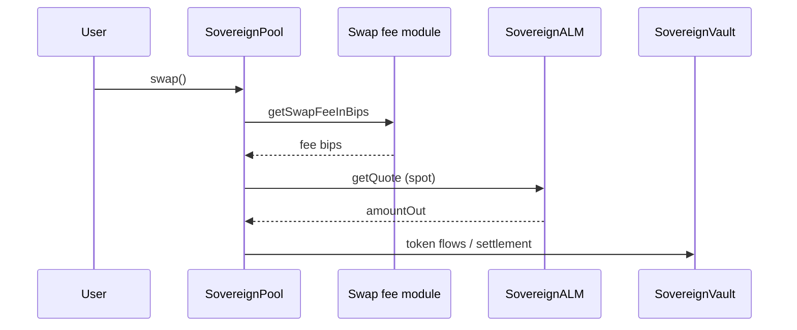
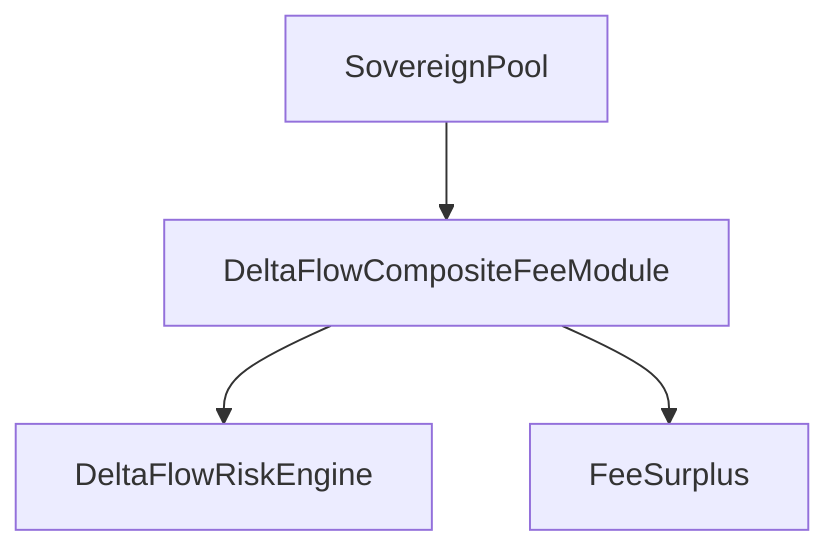

# Current implementation (trading, fees, routing)

This page describes **what the repository code does today** on **HyperEVM**: **USDC** quoted against a **base spot asset** (the primary deployment uses **PURR**; the same contracts can target **WETH** with a separate deploy and correct spot indices / decimals). The default **`DeployAll`** path wires **DeltaFlow** on-chain fee components; **BalanceSeekingSwapFeeModuleV3** remains available when **`DEPLOY_DELTAFLOW_FEE=false`**. Off-chain **API wallet** hedging is **not** the backend execution path; see **Hedge escrow** below.

---

## Trading (user-facing)

1. **Execution path** — Users trade **on-chain** by calling **`SovereignPool.swap()`**. The frontend submits this via wallet (`useSwap` → pool address + ABI).

2. **Pair** — Typically **USDC** + **base** (e.g. **PURR** with **5** decimals on testnet, or **WETH** with **18** decimals). The UI must match token decimals for the deployed pool.

3. **Pricing** — Output amounts are **not** from constant-product reserves. **`SovereignALM`**:
   - Reads **`PrecompileLib.normalizedSpotPx(spotIndex)`** for the configured market and derives **USDC per 1 base** (`getSpotPriceUSDCperPURR` — name is historical; math is USDC per base).
   - Computes **`amountOut`** from **`amountInMinusFee`** using spot math only.
   - **Reverts** if the **sovereign vault** cannot cover **`tokenOut`** plus a configured **liquidity buffer** (bps).

4. **Callbacks** — This ALM sets **`isCallbackOnSwap = false`**, so **`onSwapCallback`** is not used for extra post-swap logic.

**In short:** swaps are **HyperEVM DEX** trades against **vault inventory**, priced from the **Hyperliquid spot index** precompile, after the pool applies its **fee in bips**.

---

## How fees are composed

### Default: DeltaFlow stack (`DEPLOY_DELTAFLOW_FEE=true`)

[`DeployAll`](../../contracts/script/DeployAll.s.sol) deploys **`FeeSurplus`**, **`DeltaFlowRiskEngine`**, and **`DeltaFlowCompositeFeeModule`** (`contracts/src/deltaflow/`), then **`pool.setSwapFeeModule(composite)`** and **`feeSurplus.setPool(pool)`**. The composite module composes multiple fee components (perp execution, spot shortfall, delay, basis, funding caps, etc. — see **`DeltaFlowFeeMath`**) and consults the risk engine where configured.

Env knobs are prefixed with **`DF_`** and **`SURPLUS_FRACTION_BPS`** / **`VOLATILE_REGIME`** — see [`deploy/testnet.env.example`](../../deploy/testnet.env.example).

### Alternative: balance-seeking V3 (`DEPLOY_DELTAFLOW_FEE=false`)

On-chain fees come from **`BalanceSeekingSwapFeeModuleV3`** (`SwapFeeModuleV3.sol`) when wired as the pool’s swap fee module; otherwise the pool uses its **default fee in bips**.

When that fee module is active, **`getSwapFeeInBips`** roughly:

1. **Liquidity check** — Estimates output at spot and **reverts** if the vault cannot pay **`tokenOut`** (with buffer).

2. **Imbalance component** — Reads vault **USDC** and **base** balances, derives spot **S** (USDC per base), compares value of both sides at spot, and measures **absolute deviation in bps**.

3. **Fee formula** — **`feeAddBps = deviationBps / 10`** (steps of **0.1%** of that deviation), then **`fee = baseFeeBips + feeAddBps`**, **clamped** to **`[minFeeBips, maxFeeBips]`**.

The **pool** converts **`feeInBips`** into **`amountInWithoutFee`**, passes that to the ALM, and settles **`effectiveFee`** in **`tokenIn`**.

**Decimals:** The fee module should use the **base token’s** `decimals()` for imbalance math (see [pairs and deployment](../deployment/pairs-and-scripts.md)).

---

## How trades are placed

| Layer | Behavior |
|-------|------------|
| **Pool / users** | Trades are **EVM transactions** (`swap`). No Hyperliquid CEX order is required for the user’s swap. |
| **Backend** (`server.py`) | Subscribes to **`Swap`** logs, serves **`/escrow/trades`** when **`HEDGE_ESCROW`** is set — **no** HL API order execution. |
| **Hedge escrow** | Users call **`HedgeEscrow.openBuyPurrWithUsdc`** on-chain (name is PURR-centric; contract uses the **base** token configured at deploy); orders are sent via **CoreWriter** only. |

There is **no** on-chain **`HedgeExecutor`** or hedge FSM in the current **`contracts/src`** snapshot.

---

## Money routing: HyperEVM ↔ HyperCore

Implemented in **`SovereignVault`** using **`CoreWriterLib`** and **`PrecompileLib`**.

### Strategist / protocol operations

| Direction | Function(s) | Meaning |
|-----------|-------------|---------|
| **EVM → Core (balance only)** | `bridgeToCoreOnly` | USDC moves from the EVM vault into **HyperCore** without a vault deposit. |
| **EVM → Core vault (yield / allocation)** | `allocate` | `bridgeToCore` then `vaultTransfer(coreVault, true, …)` into a **Core vault**; **`allocatedToCoreVault`** / **`totalAllocatedUSDC`** track exposure. |
| **Core vault → EVM** | `deallocate` | `vaultTransfer(coreVault, false, …)` then `bridgeToEvm`. |
| **Core → EVM (no vault pull)** | `bridgeToEvmOnly` | When USDC is already positioned appropriately in Core. |

### During swaps

If the pool must pay USDC from the vault and **EVM USDC balance is insufficient**, **`sendTokensToRecipient`** (pool-authorized) may **`vaultTransfer(defaultVault, false, …)`** and **`bridgeToEvm`** so USDC is available on EVM, then transfer to the recipient.

### LP accounting

- **`getReserves()`** — USDC reserve includes **EVM USDC + `totalAllocatedUSDC`**; the **base** token reserve is **EVM balance**.
- **`getReservesForPool`** — USDC side can also reflect **HyperCore spot USDC** via **`PrecompileLib.spotBalance`** for reserve views.

**USDC** is the asset that **bridges** through CoreWriter-style flows; the **base** asset is primarily **ERC-20 on EVM** in the vault.

---

## Hedge escrow (CoreWriter, no API wallet execution)

Optional flow for **spot hedges** that must hit **HyperCore** via the system contract `0x3333…3333`:

- **`contracts/src/HedgeEscrow.sol`** — User approves USDC, calls `openBuyPurrWithUsdc`; the contract **`bridgeToCore`** then **`CoreWriterLib.placeLimitOrder`**. Claims bridge **`purr`** IERC20 (the **base** token at construction) back to EVM. No Hyperliquid `Exchange` / API wallet is involved in execution.
- **`backend/server.py`** — Polls the escrow contract’s **`canClaimBuy`** view and **`trades`** mapping (plus optional raw **`spotBalance`** precompile reads). Exposes **`GET /escrow/trades`** for the frontend. **Does not** submit HL API orders.

### Perp asset id vs spot limit-order asset id

Do **not** confuse **perp universe** ids (e.g. PURR = **125** in `meta`) with the **`asset`** field passed to **`placeLimitOrder`**. For **spot** books, Hyperliquid uses **`asset = 10000 + spotIndex`**, where **`spotIndex`** is the pair’s index in **`spotMeta.universe`**. Deploy scripts **`DeployHedgeEscrow.s.sol`** and optional **`DeployAll`** with **`DEPLOY_HEDGE_ESCROW=true`** compute **`spotAssetIndex`** this way. Backend **`PURR_TOKEN_INDEX`** must be the **Core token index** for the **base** EVM token (from **`PrecompileLib.getTokenIndex(base)`**), **not** the perp id.

---

## Related code paths

- `contracts/src/SovereignPool.sol` — `swap`, fee module hook, ALM quote, vault payouts.
- `contracts/src/SovereignALM.sol` — spot quote and vault liquidity check.
- `contracts/src/deltaflow/` — **`DeltaFlowCompositeFeeModule`**, **`DeltaFlowRiskEngine`**, **`FeeSurplus`**, **`DeltaFlowFeeMath`** (default fee path when **`DEPLOY_DELTAFLOW_FEE=true`**).
- `contracts/src/SwapFeeModuleV3.sol` — balance-seeking fee in bips (**`DEPLOY_DELTAFLOW_FEE=false`**).
- `contracts/src/SovereignVault.sol` — LP, Core bridge/allocate, `sendTokensToRecipient`.
- `contracts/src/HedgeEscrow.sol` — CoreWriter limit orders + `claimPurrBuy`.
- `backend/server.py` — swap log listener + escrow status polling.
- `contracts/script/DeployHedgeEscrow.s.sol` — standalone **`HedgeEscrow`** deploy with precompile-derived indices.
- `contracts/script/DeployAll.s.sol` — full PURR stack; optional **`DEPLOY_USDC_WETH`** for a second USDC/WETH stack.

See also [Pairs and deployment scripts](../deployment/pairs-and-scripts.md) and [Testnet asset IDs](../deployment/testnet-asset-ids.md).
