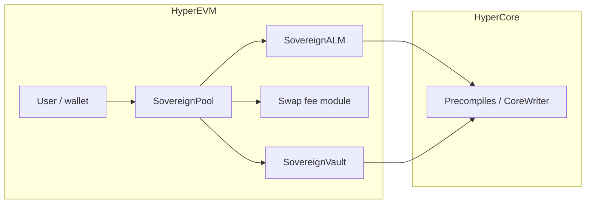

# System overview


**Authoritative detail for the current repo:** [Current implementation — trading, fees, routing](current-implementation.md) (spot-index pricing, balance-seeking fees, vault ↔ Core, optional HedgeEscrow).


DeltaFlow is designed around **spot-index pricing**, **vault-held liquidity**, and **HyperCore** connectivity on **HyperEVM**. Deployments can target **USDC/PURR**, **USDC/WETH**, or other USDC/base pairs using the same contract family with separate deploys (see [Pairs and deployment scripts](../deployment/pairs-and-scripts.md)).

## On-chain (HyperEVM) — present in this repo

| Layer | Role |
|--------|------|
| **SovereignPool** | Valantis-style pool: swap routing, swap fee module, ALM quote, vault token flows. |
| **SovereignALM** | Quotes **USDC vs base** from the Hyperliquid **spot index** (`PrecompileLib`); enforces vault liquidity for `tokenOut`. |
| **DeltaFlowCompositeFeeModule** + **FeeSurplus** + **DeltaFlowRiskEngine** | Default in **`DeployAll`** when **`DEPLOY_DELTAFLOW_FEE=true`**: multi-component fee + surplus routing + risk gate. |
| **BalanceSeekingSwapFeeModuleV3** | Alternative `ISwapFeeModule` when **`DEPLOY_DELTAFLOW_FEE=false`**: **base fee + imbalance** vs spot-valued inventory. |
| **SovereignVault** | LP token (`DFLP`), deposits/withdrawals, **USDC** bridge/allocate/deallocate via **CoreWriter**, `sendTokensToRecipient` for swaps. |
| **HedgeEscrow** (optional) | CoreWriter limit orders + claim; **no** API wallet execution. |

## HyperCore

Oracle, mark, BBO, spot balance, and **CoreWriter** precompiles sit under Hyperliquid’s stack; testnet addresses are listed in the root **README** where applicable.

## Off-chain

| Component | Role |
|-----------|------|
| **Backend (FastAPI)** | Swap log subscription, REST + `/ws`, **`/escrow/trades`** when `HEDGE_ESCROW` is configured. Does **not** execute HL API orders. |
| **Frontend (Next.js)** | Wallet on chain `998`, swap, liquidity, and **Hedge** tab (open + claim when `NEXT_PUBLIC_HEDGE_ESCROW` is set). |

## Roadmap / extended design

Additional modules (for example **circuit breaker** or a fuller **on-chain hedge FSM**) may be layered beside the default stack; the **DeltaFlow** fee and risk contracts under `contracts/src/deltaflow/` are the current multi-component fee path — see [current implementation](current-implementation.md).
