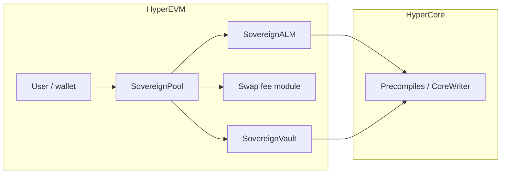

# System overview


**Authoritative detail for the current repo:** [Current implementation — trading, fees, routing](current-implementation.md) (spot-index pricing, fees, vault ↔ Core, **hedging**).


DeltaFlow is designed around **spot-index pricing**, **vault-held liquidity**, **HyperCore** connectivity on **HyperEVM**, and **hedging** so inventory risk from user flows is not left naked on the vault. **`DeployAll`** always deploys **`HedgeEscrow`** per market stack. Deployments can target **USDC/PURR**, **USDC/WETH**, or other USDC/base pairs using the same contract family with separate deploys (see [Pairs and deployment scripts](../deployment/pairs-and-scripts.md)).

### Hedging model (intent)

- **Perpetuals** — For **external-vault** pools, **`SovereignPool`** calls **`SovereignVault.processSwapHedge`** **before** paying **`tokenOut`**. The vault sends **perp IOC** orders via **CoreWriter** sized to the **base (PURR) leg**. With **`minPerpHedgeSz > 0`**, sub-minimum hedges **escrow** swap outputs until the bucket reaches the minimum, then **IOC + batch payout** in one tx. The pool’s **`hedgePerpAssetIndex`** (immutable) must match the vault’s index or **swaps revert**. See [Current implementation — On-chain per-swap perp hedge](current-implementation.md#on-chain-per-swap-perp-hedge-and-batch-queue).
- **HyperCore spot** — Used when **EVM inventory is insufficient** to fill a swap (`sendTokensToRecipient`), and via **`HedgeEscrow`** for user-initiated **spot** limit orders + claims (separate from vault per-swap perp hedging).

On-chain today, **`HedgeEscrow`** exposes **CoreWriter spot** limit orders + claim flows; **vault per-swap perp hedging** is implemented in **`SovereignVault`** — see [Current implementation](current-implementation.md).

## On-chain (HyperEVM) — present in this repo

| Layer | Role |
|--------|------|
| **SovereignPool** | Valantis-style pool: swap routing, swap fee module, ALM quote, vault token flows. |
| **SovereignALM** | Quotes **USDC vs base** from the Hyperliquid **spot index** (`PrecompileLib`); enforces vault liquidity for `tokenOut`. |
| **DeltaFlowCompositeFeeModule** + **FeeSurplus** + **DeltaFlowRiskEngine** | Default in **`DeployAll`** when **`DEPLOY_DELTAFLOW_FEE=true`**: multi-component fee + surplus routing + risk gate. |
| **BalanceSeekingSwapFeeModuleV3** | Alternative `ISwapFeeModule` when **`DEPLOY_DELTAFLOW_FEE=false`**: **base fee + imbalance** vs spot-valued inventory. |
| **SovereignVault** | LP token (`DFLP`), deposits/withdrawals, **USDC** bridge/allocate/deallocate via **CoreWriter**, `sendTokensToRecipient` / **`processSwapHedge`** (perp IOC + optional escrow + **`sz`** batch queue). |
| **HedgeEscrow** (always deployed per stack) | CoreWriter **spot** orders + claim path; **no** API wallet execution. Distinct from vault **per-swap perp** hedge. |

## HyperCore

Oracle, mark, BBO, spot balance, and **CoreWriter** precompiles sit under Hyperliquid’s stack; testnet addresses are listed in the root **README** where applicable.

## Off-chain

| Component | Role |
|-----------|------|
| **Backend (FastAPI)** | Swap log subscription, REST + `/ws`, **`/escrow/trades`**, **`HEDGE_ESCROW`** + **`PURR_TOKEN_INDEX`** required. Does **not** execute HL API orders. |
| **Frontend (Next.js)** | Wallet on chain `998`, swap, liquidity, and **Hedge** (`NEXT_PUBLIC_HEDGE_ESCROW` from deploy sync). |

## Roadmap / extended design

Additional modules (for example **circuit breaker** or richer **netting** across buy/sell hedge queues) may be layered beside the default stack; the **DeltaFlow** fee and risk contracts under `contracts/src/deltaflow/` are the current multi-component fee path — see [current implementation](current-implementation.md).
