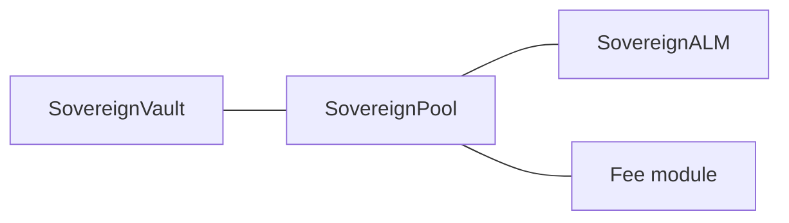

# Pairs and deployment scripts

The protocol stack is **one vault + one pool + one ALM + one fee module** per **two-token market**. Contracts name the non-USDC side `purr` in identifiers (`SovereignVault`, `BalanceSeekingSwapFeeModuleV3`) but the address can be **any** ERC-20 base asset (e.g. PURR or WETH) as long as **`SovereignALM`** is constructed with matching **`spotIndex`** and price inversion flags.

## Supported market layouts (conceptual)

| Pair | Base token (examples) | Spot index | Deploy script |
|------|------------------------|------------|---------------|
| USDC / PURR | `PURR` testnet address | `SPOT_INDEX_PURR` | [`DeployAll.s.sol`](../../contracts/script/DeployAll.s.sol), [`DeployHedgeEscrow.s.sol`](../../contracts/script/DeployHedgeEscrow.s.sol) |
| USDC / WETH | Wrapped ETH on HyperEVM | `SPOT_INDEX_WETH` | [`DeployUsdcWeth.s.sol`](../../contracts/script/DeployUsdcWeth.s.sol) (standalone), or **`DeployAll`** with **`DEPLOY_USDC_WETH=true`** ([`AmmDeployBase.s.sol`](../../contracts/script/AmmDeployBase.s.sol) shared logic) |

Each deployment gets its own **`SovereignVault`** (its own **DFLP** LP token address) and its own **`WATCH_POOL`** for backends/frontends.

## Environment flags (`DeployAll.s.sol`)

| Variable | Role |
|----------|------|
| `SKIP_HL_AGENT` | If `true`, skips vault `approveAgent` (no API wallet on vault). |
| `DEPLOY_HEDGE_ESCROW` | If `true`, deploys [`HedgeEscrow`](../../contracts/src/HedgeEscrow.sol) **per stack** in that run (PURR stack, and WETH stack too if `DEPLOY_USDC_WETH=true`). |
| `DEPLOY_USDC_WETH` | If `true` (with `DeployAll` only): after USDC/PURR, deploy a **second** full stack for USDC/WETH using `WETH`, `SPOT_INDEX_WETH`, `INVERT_WETH_PX`. |
| `DEPLOY_DELTAFLOW_FEE` | Default **`true`**: deploy **`FeeSurplus`**, **`DeltaFlowRiskEngine`**, **`DeltaFlowCompositeFeeModule`** and wire the pool. If **`false`**, deploys **`BalanceSeekingSwapFeeModuleV3`** only (plus `DF_*` env ignored for deployment). |
| `RAW_PX_SCALE` | Optional; default **`100_000_000`** (`1e8`). Scale for `PrecompileLib.normalizedSpotPx` (matches [`SovereignALM`](../../contracts/src/SovereignALM.sol)). |
| `RAW_PX_SCALE_WETH` | Optional override for the WETH stack; falls back to `RAW_PX_SCALE` or `1e8`. |

After broadcast, run **`python3 scripts/sync_env_from_broadcast.py`** (or **`./scripts/deploy_all_testnet.sh`** for an all-in-one deploy) to merge addresses into **`frontend/.env.local`** and **`backend/.env`** from **`broadcast/DeployAll.s.sol/<chain>/run-latest.json`**. For other scripts, pass **`--broadcast-json path/to/run-latest.json`**. See [Testnet asset IDs](testnet-asset-ids.md) for **`SPOT_INDEX_*`** and CoreWriter asset ids.

## Fee module and decimals

[`BalanceSeekingSwapFeeModuleV3`](../../contracts/src/SwapFeeModuleV3.sol) uses the **base token’s** `decimals()` and the same **`rawPxScale` / `rawIsPurrPerUsdc`** pricing as **`SovereignALM`** for imbalance and spot liquidity checks.

## Hedge escrow per pair

[`HedgeEscrow`](../../contracts/src/HedgeEscrow.sol) is deployed with `(usdc, base, spotAssetIndex, baseTokenIndex)`. A **second** escrow for WETH uses the same contract with `base = WETH` and `spotAssetIndex = 10000 + PrecompileLib.getSpotIndex(weth)`.

## Related

- [Current implementation — trading, fees, routing](../architecture/current-implementation.md)
- [Quick start](../getting-started/quick-start.md)
- [Testnet asset IDs](testnet-asset-ids.md)
