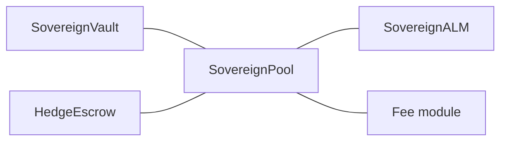
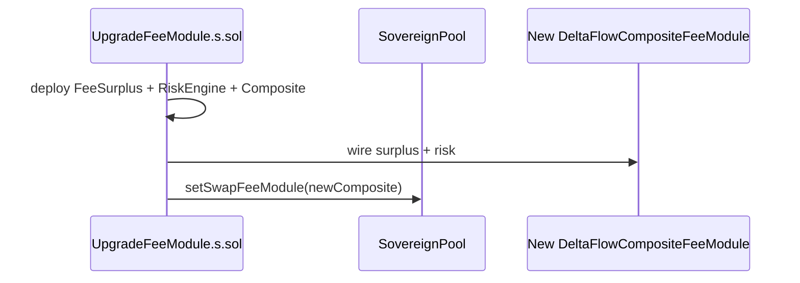

# Pairs and deployment scripts

The protocol stack is **one vault + one pool + one ALM + one fee module + one HedgeEscrow** per **two-token market**. Contracts name the non-USDC side `purr` in identifiers (`SovereignVault`, `BalanceSeekingSwapFeeModuleV3`) but the address can be **any** ERC-20 base asset (e.g. PURR or WETH) as long as **`SovereignALM`** is constructed with matching **`spotIndex`** and price inversion flags.



## Supported market layouts (conceptual)

| Pair | Base token (examples) | Spot index | Deploy script |
|------|------------------------|------------|---------------|
| USDC / PURR | `PURR` testnet address | `SPOT_INDEX_PURR` | [`DeployAll.s.sol`](../../contracts/script/DeployAll.s.sol), [`DeployHedgeEscrow.s.sol`](../../contracts/script/DeployHedgeEscrow.s.sol) |
| USDC / WETH | Wrapped ETH on HyperEVM | `SPOT_INDEX_WETH` | [`DeployUsdcWeth.s.sol`](../../contracts/script/DeployUsdcWeth.s.sol) (standalone), or **`DeployAll`** with **`DEPLOY_USDC_WETH=true`** ([`AmmDeployBase.s.sol`](../../contracts/script/AmmDeployBase.s.sol) shared logic) |

Each deployment gets its own **`SovereignVault`** (its own **DFLP** LP token address) and its own **`WATCH_POOL`** for backends/frontends.

## Environment flags (`DeployAll.s.sol`)

| Variable | Role |
|----------|------|
| `SKIP_HL_AGENT` | If `true`, skips vault `approveAgent` (no API wallet on vault). |
| *(always)* | [`HedgeEscrow`](../../contracts/src/HedgeEscrow.sol) is deployed **once per stack** (USDC/PURR and, if enabled, USDC/WETH). |
| `DEPLOY_USDC_WETH` | If `true` (with `DeployAll` only): after USDC/PURR, deploy a **second** full stack for USDC/WETH using `WETH`, `SPOT_INDEX_WETH`, `INVERT_WETH_PX`. |
| `DEPLOY_DELTAFLOW_FEE` | Default **`true`**: deploy **`FeeSurplus`**, **`DeltaFlowRiskEngine`**, **`DeltaFlowCompositeFeeModule`** and wire the pool. If **`false`**, deploys **`BalanceSeekingSwapFeeModuleV3`** only (plus `DF_*` env ignored for deployment). |
| `RAW_PX_SCALE` | Optional; default **`100_000_000`** (`1e8`). Scale for `PrecompileLib.normalizedSpotPx` (matches [`SovereignALM`](../../contracts/src/SovereignALM.sol)). |
| `RAW_PX_SCALE_WETH` | Optional override for the WETH stack; falls back to `RAW_PX_SCALE` or `1e8`. |
| `PERP_INDEX_PURR` / `PERP_INDEX_WETH` | **Required** for vault-backed pool deploy: Hyperliquid **perp universe asset index** for the base asset. Wired to **`SovereignPool.hedgePerpAssetIndex`** (immutable) and **`SovereignVault.setHedgePerpAsset`**. Must **not** be `uint32.max` (`4294967295`) for this path — that sentinel value is only for **skipping perp *reads*** inside the DeltaFlow composite fee module when you are not using the full vault+pool hedge stack. [`AmmDeployBase`](../../contracts/script/AmmDeployBase.s.sol) **`require`s** a real index before deploying the pool. |
| `USE_MARK_MIN_HEDGE_SZ` | Default **`true`**: [`SovereignVault`](../../contracts/src/SovereignVault.sol) uses **`normalizedMarkPx`** + HL ~**$10** min notional for the batch threshold (optional **`MIN_PERP_HEDGE_SZ_FLOOR`**). Opposite swap flow **nets** queued hedge `sz` and releases escrow FIFO before adding to the same-side queue. DeltaFlow fee snapshot adjusts **`perpSzi`** by pending queue. Set **`false`** and **`MIN_PERP_HEDGE_SZ_FLOOR=0`** for IOC every swap (no queue). |
| `MIN_PERP_HEDGE_SZ_FLOOR` | Optional minimum HL **`sz`** when mark-based mode is on; fixed threshold when mark mode is off (see vault NatSpec). |

After broadcast, run **`python3 scripts/sync_env_from_broadcast.py`** (or **`./scripts/deploy_all_testnet.sh`** for an all-in-one deploy) to merge addresses into **`frontend/.env.local`** and **`backend/.env`** from **`broadcast/DeployAll.s.sol/<chain>/run-latest.json`**. For other scripts, pass **`--broadcast-json path/to/run-latest.json`**. See [Testnet asset IDs](testnet-asset-ids.md) for **`SPOT_INDEX_*`** and CoreWriter asset ids.

## Fee-only upgrade (composite fee stack)

To deploy **new** **`FeeSurplus`**, **`DeltaFlowRiskEngine`**, and **`DeltaFlowCompositeFeeModule`** bytecode **without** redeploying vault, pool, or ALM (e.g. after changing `contracts/src/deltaflow/*.sol`):

1. Set **`EXISTING_POOL`** and/or **`EXISTING_POOL_WETH`** in **`.env`** to the live **`SovereignPool`** address(es).
2. Ensure the pool’s **`swapFeeModuleUpdateTimestamp`** is in the past (respect **`SWAP_FEE_MODULE_TIMELOCK_SEC`**; use **`0`** on testnet for repeated rewires).
3. Run from repo root:

   ```bash
   ./scripts/upgrade_fee_module_testnet.sh primary   # USDC/PURR pool
   ./scripts/upgrade_fee_module_testnet.sh weth      # USDC/WETH pool
   ./scripts/upgrade_fee_module_testnet.sh both
   ```

   This invokes **[`UpgradeFeeModule.s.sol`](../../contracts/script/UpgradeFeeModule.s.sol)** (`runPrimary` / `runWeth`), which **`broadcast`s** a new fee stack and calls **`pool.setSwapFeeModule(newComposite)`**.

4. Update **`frontend/.env.local`** / **`backend/.env`** with the logged **swap fee module**, **FeeSurplus**, and **DeltaFlowRiskEngine** addresses (or run **`sync_env_from_broadcast.py`** against the new broadcast JSON if you extend the script).



See also [Current implementation — fee branches](../architecture/current-implementation.md#composite-quote-branches-getswapfeeinbips).

## Frontend labels and market switcher

The Next.js app reads **`NEXT_PUBLIC_*`** pool/vault/ALM addresses from **`frontend/.env.local`** (synced by the script above). When a **second** stack is deployed (`NEXT_PUBLIC_POOL_WETH` non-zero), the header **market switcher** toggles **primary** vs **secondary**.

| Variable | Role |
|----------|------|
| `NEXT_PUBLIC_PRIMARY_BASE_SYMBOL` | Display label for the primary pool’s base token (default **`PURR`**). |
| `NEXT_PUBLIC_SECONDARY_BASE_SYMBOL` | Display label for the secondary stack (default **`WETH`**, or **`NEXT_PUBLIC_WETH_SYMBOL`**). |

The **ALM** contract exposes **`getSpotPriceUsdcPerBase()`** for spot USDC-per-base pricing (redeploy required if you still have the old **`getSpotPriceUSDCperPURR`** name).

## Fee module and decimals

[`BalanceSeekingSwapFeeModuleV3`](../../contracts/src/SwapFeeModuleV3.sol) uses the **base token’s** `decimals()` and the same **`rawPxScale` / `rawIsPurrPerUsdc`** pricing as **`SovereignALM`** for imbalance and spot liquidity checks.

## Hedge escrow per pair

[`HedgeEscrow`](../../contracts/src/HedgeEscrow.sol) is deployed with `(usdc, base, spotAssetIndex, baseTokenIndex)`. A **second** escrow for WETH uses the same contract with `base = WETH` and `spotAssetIndex = 10000 + PrecompileLib.getSpotIndex(weth)`.

## Related

- [Current implementation — trading, fees, routing](../architecture/current-implementation.md)
- [Quick start](../getting-started/quick-start.md)
- [Testnet asset IDs](testnet-asset-ids.md)
