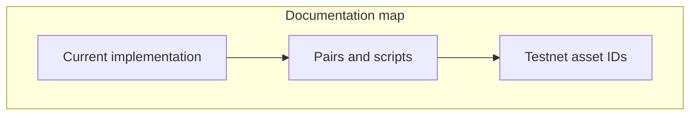
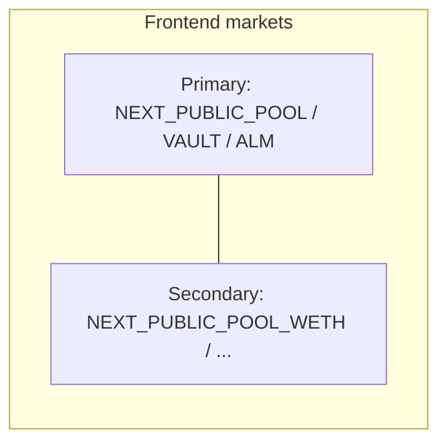

# At a glance

* **Chain:** Hyperliquid Testnet HyperEVM (chain ID `998`) for development.
* **On-chain:** `SovereignPool` + `SovereignALM` + `SovereignVault` + default **DeltaFlow** fee stack (`DeltaFlowCompositeFeeModule`, `FeeSurplus`, `DeltaFlowRiskEngine`, `DeltaFeeHelper` path integrals over hedge utilization) or `BalanceSeekingSwapFeeModuleV3` + **`HedgeEscrow`** per market stack. External-vault pools enforce matching **`hedgePerpAssetIndex`** and **`processSwapHedge`** (perp IOC; optional **mark-based** batch threshold + opposite-direction **netting**; see deployment env **`USE_MARK_MIN_HEDGE_SZ`**).
* **Pairs:** **Primary** stack (`NEXT_PUBLIC_POOL`, …) and optional **secondary** stack (`NEXT_PUBLIC_POOL_WETH`, …) use the same contract family per **USDC/base** market. See [Pairs and deployment scripts](../deployment/pairs-and-scripts.md).
* **Off-chain:** FastAPI backend for swap logs, **`HEDGE_ESCROW`**, **`PURR_TOKEN_INDEX`**, **`/escrow/trades`**; Next.js for swap, liquidity, and Hedge UI.

For the **accurate, code-level** description, use [Current implementation](../architecture/current-implementation.md).

This documentation matches **`contracts/src`** and the backend in this repository. For the full detail, start with [Current implementation](../architecture/current-implementation.md).

Labels for the **base** symbol (e.g. PURR vs WETH) use **`NEXT_PUBLIC_PRIMARY_BASE_SYMBOL`** and **`NEXT_PUBLIC_SECONDARY_BASE_SYMBOL`** (see [Pairs and deployment scripts](../deployment/pairs-and-scripts.md)).
