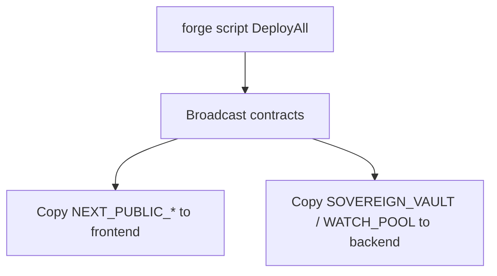

# Quick start

For an **end-to-end** guide (deploy, start servers, swaps, ~$50 test portfolio, second pool notes), use **[Full stack runbook](full-stack-runbook.md)**.

Prerequisites: **Foundry**, **Node.js ≥ 18**, **Python ≥ 3.10**.

**Target chain:** Hyperliquid **testnet** HyperEVM (**998**). Use [`deploy/testnet.env.example`](../../deploy/testnet.env.example) as the forge env template and [Testnet asset IDs](../deployment/testnet-asset-ids.md) for indices.



## 1. Clone and env files

```bash
git clone <your-repo-url> && cd DeltaFlow
cp backend/.env.example backend/.env
cp frontend/.env.example frontend/.env.local
# After deploy + sync: backend/.env and frontend/.env.local get contract addresses automatically.
# You must still set NEXT_PUBLIC_WALLETCONNECT_PROJECT_ID in frontend/.env.local.
```

## 2. Build contracts

```bash
forge build --force
```

## 3. Deploy (Hyperliquid testnet)

Copy [`deploy/testnet.env.example`](../../deploy/testnet.env.example) to the repo root as **`.env`** (or export vars). Fill **`PRIVATE_KEY`**, **`POOL_MANAGER`**, **`SPOT_INDEX_PURR`** (from [`ReadSpotIndex`](../../contracts/script/ReadSpotIndex.s.sol)), and optional DeltaFlow / V3 fee knobs. **`DEPLOY_DELTAFLOW_FEE`** defaults to **`true`** (DeltaFlow composite fee module + surplus + risk engine).

**USDC / PURR (full AMM stack):** Prefer **`./scripts/deploy_all_testnet.sh`** — it passes **`--fork-url`** and **`--fork-block-number`** so Forge simulates against HyperEVM ( **`PrecompileLib`** / HedgeEscrow need HL precompiles; plain `--rpc-url` only reverts on `0x…080C`).

Manual:

```bash
RPC=https://rpc.hyperliquid-testnet.xyz/evm
forge script contracts/script/DeployAll.s.sol:DeployAll \
  --rpc-url "$RPC" \
  --fork-url "$RPC" \
  --fork-block-number "$(cast block-number --rpc-url "$RPC")" \
  --broadcast -vvvv
```

Set env vars as required by `DeployAll` (`PRIVATE_KEY`, `USDC`, `PURR`, `POOL_MANAGER`, `SPOT_INDEX_PURR`, `INVERT_PURR_PX`, fee bips, etc.). For the **standard external-vault stack** (on-chain per-swap perp hedge), set **`PERP_INDEX_PURR`** to the Hyperliquid **perp** index for PURR (not `uint32.max`). Optional **`USE_MARK_MIN_HEDGE_SZ`** (default on in `AmmDeployBase`) uses the vault’s **mark-based ~$10** threshold, **nets** opposite hedge flow against the queue, and escrows until an IOC batch; turn off + no floor for immediate IOC each swap. Optional: `SKIP_HL_AGENT=true`, `RAW_PX_SCALE` (defaults to `1e8`), `DEPLOY_USDC_WETH=true` plus `WETH`, `SPOT_INDEX_WETH`, `INVERT_WETH_PX`, `PERP_INDEX_WETH` for a second stack in one broadcast. **`HedgeEscrow`** is always deployed per stack.

See [Current implementation — per-swap hedge & queue](../architecture/current-implementation.md#on-chain-per-swap-perp-hedge-and-batch-queue) and [Pairs and deployment scripts](../deployment/pairs-and-scripts.md).

After **`--broadcast`**, run **`python3 scripts/sync_env_from_broadcast.py`** ( **`deploy_all_testnet.sh`** does this at the end) to merge addresses into **`frontend/.env.local`** and **`backend/.env`** from `broadcast/DeployAll.s.sol/998/run-latest.json` (set **`RPC_URL`** so `cast` can fill **`PURR_TOKEN_INDEX`** when needed).

**HedgeEscrow only:** use the same **`--fork-url`** / **`--fork-block-number`** pattern as `DeployAll`.

```bash
RPC=https://rpc.hyperliquid-testnet.xyz/evm
forge script contracts/script/DeployHedgeEscrow.s.sol:DeployHedgeEscrow \
  --rpc-url "$RPC" --fork-url "$RPC" \
  --fork-block-number "$(cast block-number --rpc-url "$RPC")" \
  --broadcast -vvvv
```

**USDC / WETH** (standalone stack):

```bash
RPC=https://rpc.hyperliquid-testnet.xyz/evm
forge script contracts/script/DeployUsdcWeth.s.sol:DeployUsdcWeth \
  --rpc-url "$RPC" --fork-url "$RPC" \
  --fork-block-number "$(cast block-number --rpc-url "$RPC")" \
  --broadcast -vvvv
```

Or deploy **PURR + WETH** in one run: set `DEPLOY_USDC_WETH=true` and the `WETH` / `SPOT_INDEX_WETH` / `INVERT_WETH_PX` env vars when running `DeployAll`. See [Pairs and deployment scripts](../deployment/pairs-and-scripts.md).

## 4. Backend

```bash
cd backend
pip install -r requirements.txt
python server.py
```

## 5. Frontend

```bash
cd frontend
pnpm install
pnpm dev
```

Ensure **`frontend/.env.local`** exists (from **`frontend/.env.example`**) with **`NEXT_PUBLIC_WALLETCONNECT_PROJECT_ID`** and, for the Hedge tab, **`NEXT_PUBLIC_BACKEND_URL=http://127.0.0.1:8000`**. Contract addresses are merged by **`sync_env_from_broadcast.py`** after deploy.

## Optional: Python deploy helper

After `forge build`, you can use the root `deploy.py` for vault/ALM/fee-module flows (see `python deploy.py --help`).
