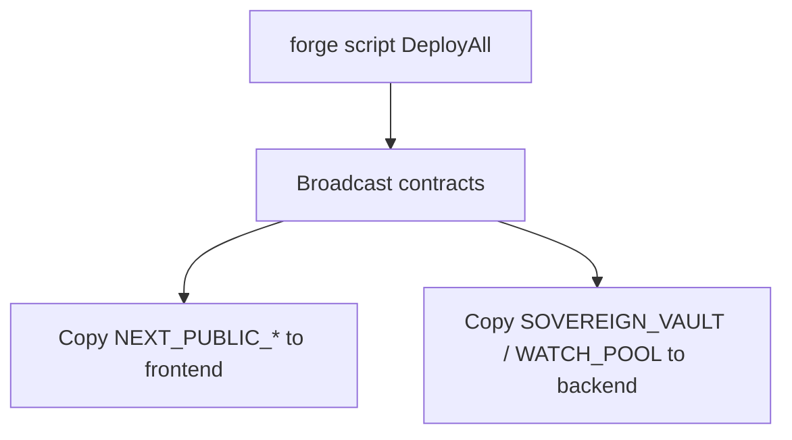

# Quick start

Prerequisites: **Foundry**, **Node.js ≥ 18**, **Python ≥ 3.10**.

**Target chain:** Hyperliquid **testnet** HyperEVM (**998**). Use [`deploy/testnet.env.example`](../../deploy/testnet.env.example) as the forge env template and [Testnet asset IDs](../deployment/testnet-asset-ids.md) for indices.



## 1. Clone and backend env

```bash
git clone <your-repo-url> && cd DeltaFlow
cp backend/.env.example backend/.env
# Fill in: ALCHEMY_WSS_URL, EVM_RPC_HTTP_URL, SOVEREIGN_VAULT, WATCH_POOL,
# USDC_ADDRESS, PURR_ADDRESS, HEDGE_ESCROW, PURR_TOKEN_INDEX (or run sync after deploy)
```

## 2. Build contracts

```bash
forge build --force
```

## 3. Deploy (Hyperliquid testnet)

Copy [`deploy/testnet.env.example`](../../deploy/testnet.env.example) to the repo root as **`.env`** (or export vars). Fill **`PRIVATE_KEY`**, **`POOL_MANAGER`**, **`SPOT_INDEX_PURR`** (from [`ReadSpotIndex`](../../contracts/script/ReadSpotIndex.s.sol)), and optional DeltaFlow / V3 fee knobs. **`DEPLOY_DELTAFLOW_FEE`** defaults to **`true`** (DeltaFlow composite fee module + surplus + risk engine).

**USDC / PURR (full AMM stack):**

```bash
forge script contracts/script/DeployAll.s.sol:DeployAll \
  --rpc-url https://rpc.hyperliquid-testnet.xyz/evm \
  --broadcast -vvvv
```

Set env vars as required by `DeployAll` (`PRIVATE_KEY`, `USDC`, `PURR`, `POOL_MANAGER`, `SPOT_INDEX_PURR`, `INVERT_PURR_PX`, fee bips, etc.). Optional: `SKIP_HL_AGENT=true`, `RAW_PX_SCALE` (defaults to `1e8`), `DEPLOY_USDC_WETH=true` plus `WETH`, `SPOT_INDEX_WETH`, `INVERT_WETH_PX` for a second stack in one broadcast. **`HedgeEscrow`** is always deployed per stack.

After **`--broadcast`**, run **`./scripts/deploy_all_testnet.sh`** (deploy + sync) or **`python3 scripts/sync_env_from_broadcast.py`** to merge addresses into **`frontend/.env.local`** and **`backend/.env`** from `broadcast/DeployAll.s.sol/998/run-latest.json` (set **`RPC_URL`** so `cast` can fill **`PURR_TOKEN_INDEX`** when HedgeEscrow is deployed).

**HedgeEscrow only:**

```bash
forge script contracts/script/DeployHedgeEscrow.s.sol:DeployHedgeEscrow \
  --rpc-url https://rpc.hyperliquid-testnet.xyz/evm \
  --broadcast -vvvv
```

**USDC / WETH** (standalone stack):

```bash
forge script contracts/script/DeployUsdcWeth.s.sol:DeployUsdcWeth \
  --rpc-url https://rpc.hyperliquid-testnet.xyz/evm \
  --broadcast -vvvv
```

Or deploy **PURR + WETH** in one run: set `DEPLOY_USDC_WETH=true` and the `WETH` / `SPOT_INDEX_WETH` / `INVERT_WETH_PX` env vars when running `DeployAll`. See [Pairs and deployment scripts](../deployment/pairs-and-scripts.md).

## 4. Backend

```bash
cd backend
pip install -r requirements.txt
python server.py
```

## 5. Frontend

```bash
cd frontend
cp .env.example .env.local   # NEXT_PUBLIC_* contract addresses + WalletConnect project ID
pnpm install
pnpm dev
```

## Optional: Python deploy helper

After `forge build`, you can use the root `deploy.py` for vault/ALM/fee-module flows (see `python deploy.py --help`).
