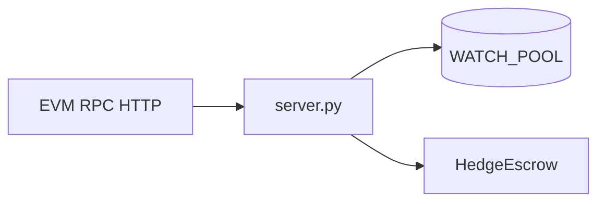

# Backend API

The FastAPI app in **`backend/server.py`** indexes **`Swap`** logs from **`WATCH_POOL`** via periodic **`eth_getLogs`** on **`EVM_RPC_HTTP_URL`** (default **30s** interval) and polls **`HedgeEscrow`** + Core precompiles so the UI can show **claimable** **spot** hedges. **`HEDGE_ESCROW`** and **`PURR_TOKEN_INDEX`** are **required**. **Hyperliquid API wallets / `Exchange` are not used** for that path — orders are placed on-chain via **CoreWriter** inside **`HedgeEscrow.sol`**.

**Vault per-swap perp hedging** runs entirely **on-chain** in **`SovereignVault.processSwapHedge`** (before **`tokenOut`**, with optional escrow when **`minPerpHedgeSz > 0`**); the backend does not submit those orders. See [Current implementation](../architecture/current-implementation.md#on-chain-per-swap-perp-hedge-and-batch-queue).

## HTTP

| Endpoint | Method | Description |
|----------|--------|-------------|
| `/health` | GET | Pool, chain, **`hedgeEscrow`**, **`purrTokenIndex`**, escrow / swap poll intervals, **`lastSwapBlockProcessed`**. |
| `/events` | GET | Recent decoded swap events (`limit`). |
| `/escrow/trades` | GET | Snapshot of all escrow trades + **`canClaimBuy`**. |
| `/escrow/spot/{user}` | GET | Raw **`spotBalance`** precompile reads for USDC (`token 0`) and base token (**`PURR_TOKEN_INDEX`** — Core token index for the pool base asset; name is legacy). |

## WebSocket

| Path | Description |
|------|-------------|
| `/ws` | Swap events + **`escrow_claimable`** when claimability changes. |

## Environment

See **`backend/.env.example`**. Important:

- **`HEDGE_ESCROW`** — Deployed **`HedgeEscrow`** address.
- **`PURR_TOKEN_INDEX`** — HyperCore **token index** for the **base** asset (PURR, WETH, etc.), not the perp universe id.

Tune **`ESCROW_POLL_INTERVAL_S`** (default **4**), **`SWAP_POLL_INTERVAL_S`** (default **30**), and optional **`SWAP_LOG_LOOKBACK_BLOCKS`** on first boot (default **0** = start at current head only).

## Frontend

Set **`NEXT_PUBLIC_HEDGE_ESCROW`** and **`NEXT_PUBLIC_BACKEND_URL`** (e.g. `http://127.0.0.1:3000`) for the **Hedge** tab.
