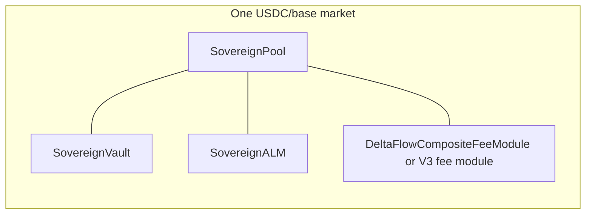

# Protocol contracts

Deploy scripts live under `contracts/script/`:

- **`AmmDeployBase.s.sol`** — Shared deploy logic for one USDC/base market (used by the scripts below).
- **`DeployAll.s.sol`** — **USDC/PURR** stack + **`HedgeEscrow`**; optional **`DEPLOY_USDC_WETH`** adds a second **USDC/WETH** stack (second **`HedgeEscrow`**) in the same broadcast. Env: **`SKIP_HL_AGENT`**, **`DEPLOY_DELTAFLOW_FEE`**, **`RAW_PX_SCALE`**, pair-specific **`INVERT_*_PX`**. See [Pairs and deployment scripts](../deployment/pairs-and-scripts.md).
- **`DeployUsdcWeth.s.sol`** — Single **USDC/WETH** stack only (`WETH`, `SPOT_INDEX_WETH`, `INVERT_WETH_PX`, optional `RAW_PX_SCALE_WETH`).
- **`DeployHedgeEscrow.s.sol`** — Standalone **`HedgeEscrow`** with `spotAssetIndex = 10000 + spotIndex`.

Constructor wiring for **`SovereignALM`** uses **`rawPxScale`** / **`rawIsPurrPerUsdc`**; the default fee path uses **`DeltaFlowCompositeFeeModule`** with matching price inputs. See [Current implementation](../architecture/current-implementation.md).

## Core (this repo)

- **SovereignPool** — Swaps and pool configuration; calls the swap fee module (if set), then the ALM, then settles tokens and fees. When **`sovereignVault`** is an **external** contract, the constructor sets **`hedgePerpAssetIndex`**; **`swap`** reverts unless **`vault.hedgePerpAssetIndex()`** matches and is non-zero. Before **`tokenOut`**, the pool calls **`vault.processSwapHedge`**; if it returns **`true`**, the pool pays **`amountOut`** via **`sendTokensToRecipient`** (otherwise the vault escrowed output or paid in a flush).
- **SovereignALM** — **USDC/base** quotes from **`PrecompileLib.normalizedSpotPx`**; reverts if the vault cannot deliver **`tokenOut`** (+ buffer).
- **SovereignVault** — **ERC-20 LP** shares, `depositLP` / `withdrawLP`, **USDC** ↔ **HyperCore** via **`CoreWriterLib`**, **`sendTokensToRecipient`**. **`processSwapHedge`** (pool-only): **perp IOC** via **`CoreWriterLib.placeLimitOrder`**, optional **payout escrow** when **`minPerpHedgeSz > 0`** — see [batch queue + escrow](../architecture/current-implementation.md#on-chain-per-swap-perp-hedge-and-batch-queue).

## Swap fees

- **DeltaFlowCompositeFeeModule** (`contracts/src/deltaflow/`) — Default when **`DEPLOY_DELTAFLOW_FEE=true`**: **`ISwapFeeModule`** implementation composed with **`FeeSurplus`**, **`DeltaFlowRiskEngine`**, and **`DeltaFlowFeeMath`** parameters (`DF_*` env).

- **BalanceSeekingSwapFeeModuleV3** (`SwapFeeModuleV3.sol`) — Used when **`DEPLOY_DELTAFLOW_FEE=false`**: **base + imbalance** fee in bips; **base `decimals()`** and **`rawPxScale` / inversion** match **`SovereignALM`**.

If no fee module is configured, the pool uses its **default swap fee bips** (see `SovereignPool`).

## Hedge escrow

- **HedgeEscrow** — **Deployed with every market stack**; CoreWriter **spot** orders + claim path for the **base** token configured at deploy. **Vault per-swap perp** hedging is separate (see **SovereignVault** above).

## Source of truth

ABIs and bytecode: **`contracts/src/`** and Foundry **`out/`**. Runtime addresses: deployment records, **`frontend/.env.example`** (**`NEXT_PUBLIC_*`**), **`backend/.env.example`**, and [`deploy/testnet.env.example`](../../deploy/testnet.env.example) for forge. Indices and asset ids: [Testnet asset IDs](../deployment/testnet-asset-ids.md).
